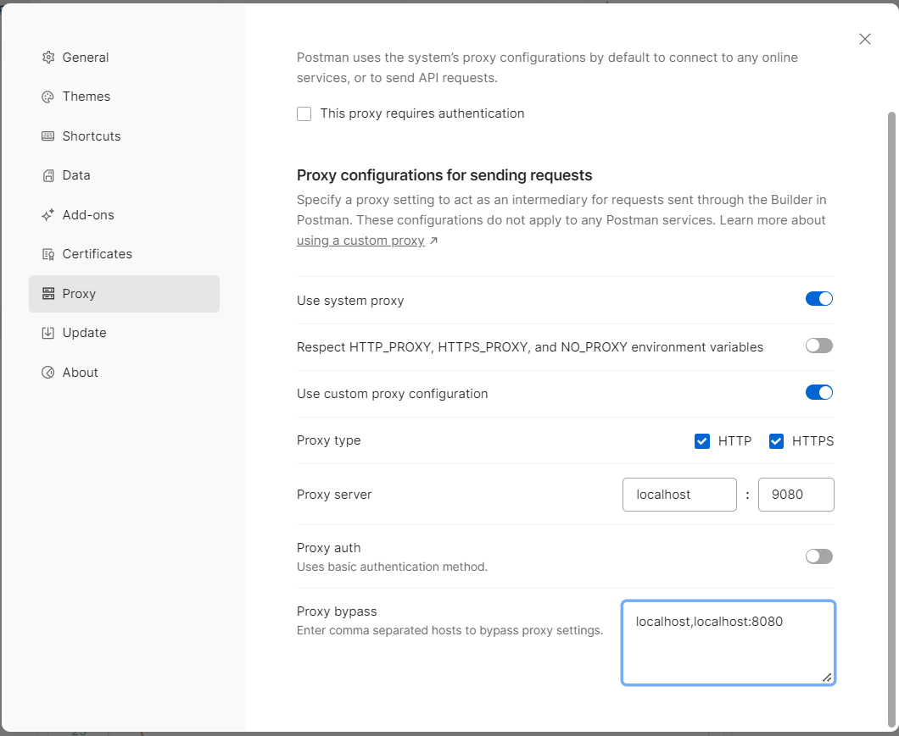

# HTTP proxy over socks proxy

This is a simple proxy using a combination of socks proxy and http proxy open source tools. You can use it for instance to perform requests with Postman app over a socks proxy.

## How to use

You will need a ssh server which will be your proxy, and docker with docker compose on the machine from which you want to connect. On the ssh server to be used as a proxy, you will need to have a user with an ssh key configured. For example, you can configure your user to use your ssh key like so (adjust username and ip address accordingly):

```
ssh-copy-id myuser@10.0.0.1
```

Then, create in this repo an .env file with the following content:

```
JUMP_USER=mysuer
JUMP_HOST=10.0.0.1
JUMP_PORT=2222
```

Then, copy your `id_rsa` public key to the root of this repo:

```
cp ~/.ssh/id_rsa .
```

Then, build and run this proxy:

```
docker compose build
docker compose up -d
```

And finally, add this proxy to your postman configuration like so:


